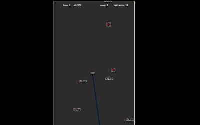

# Blackout

Blackout is an arcade jumper. You should jump on platforms, turn on ones, connect them into cluster. Kill enemy drones and prevent them from damaging your connected platforms.

In case of stuck use drones as platforms.

This game was made for [js13kGames](http://js13kgames.com) 2018. The theme of the year was **offline**.

**Minimal screen requirements:** 360x640 WxH

**Final Size:** 13135 bytes

# Resources

**Logic** [typescript](https://www.typescriptlang.org/)

**Assets** [piskelapp](https://www.piskelapp.com/), [my assets gallery here](https://www.piskelapp.com/user/6279952341139456)

**Music** [soundbox.js](http://sb.bitsnbites.eu/)

**Engine** [Kontra.js](https://github.com/straker/kontra)

# Features

**Multiple lives** 3 lives + 1 per 100 score points

**Enemies** servant drones

**Score:** score points =  killed drones + connected platofrms

# Controls

**Keyboard** Left\Right arrows

**Touchscreen** Touch left\right screen sides

# Credits

**Created By** [Andrew Avdeev](http://aavdeev.com)

**Inspiration and Ideas:** [Doodle jump](https://en.wikipedia.org/wiki/Doodle_Jump)

**Special Thanks:** Thanks to my wife Ann and my little son.

# License
MIT